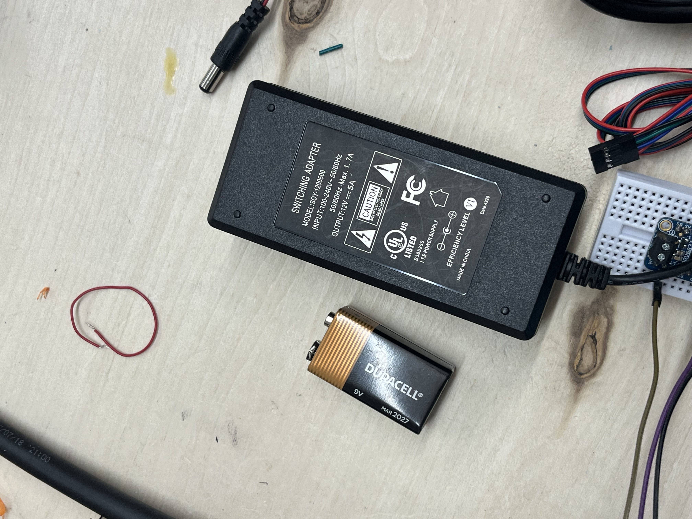
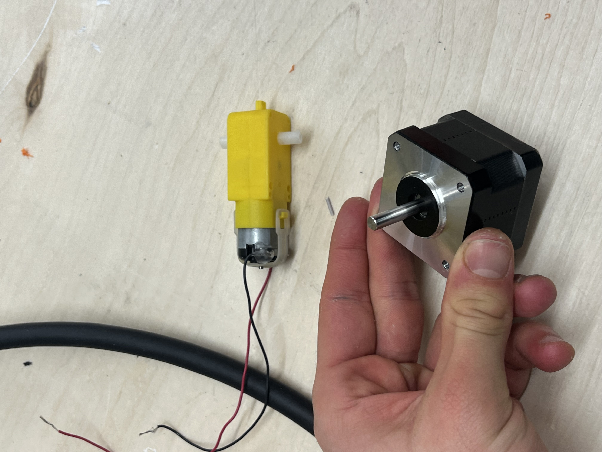
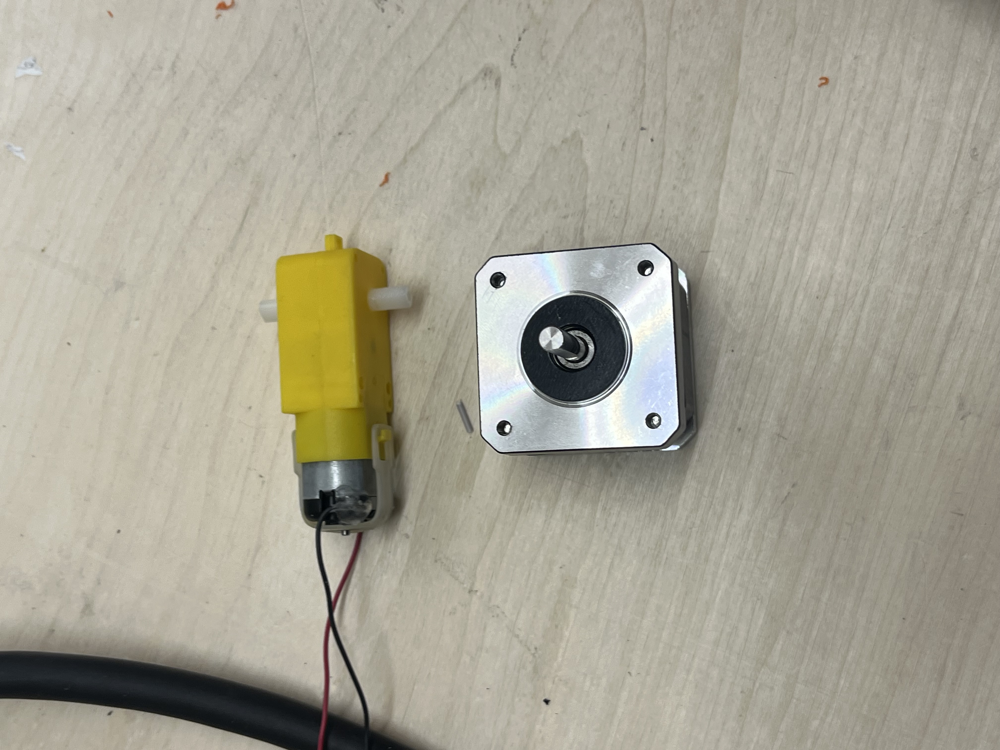
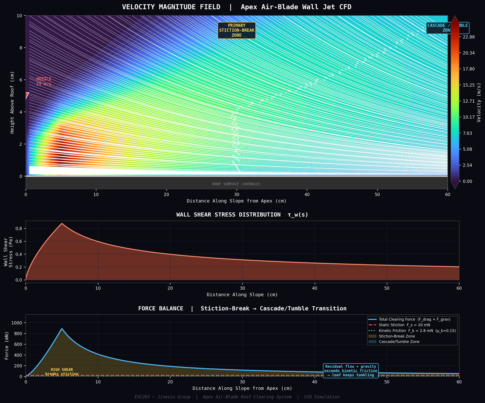
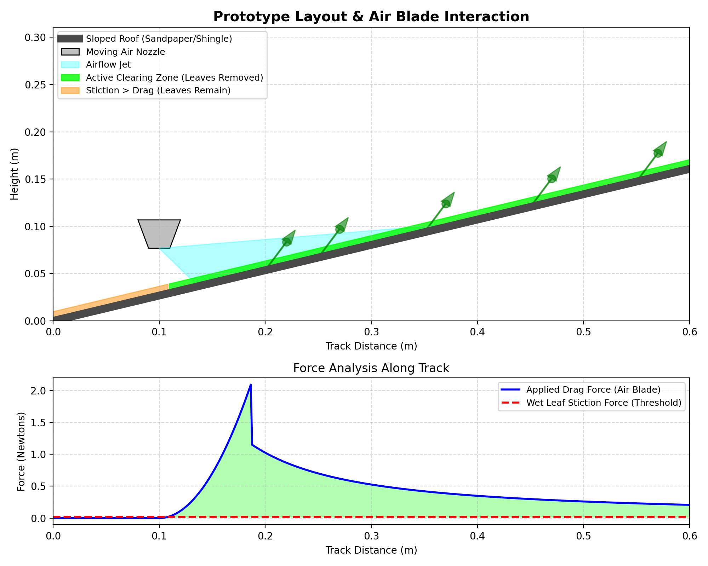
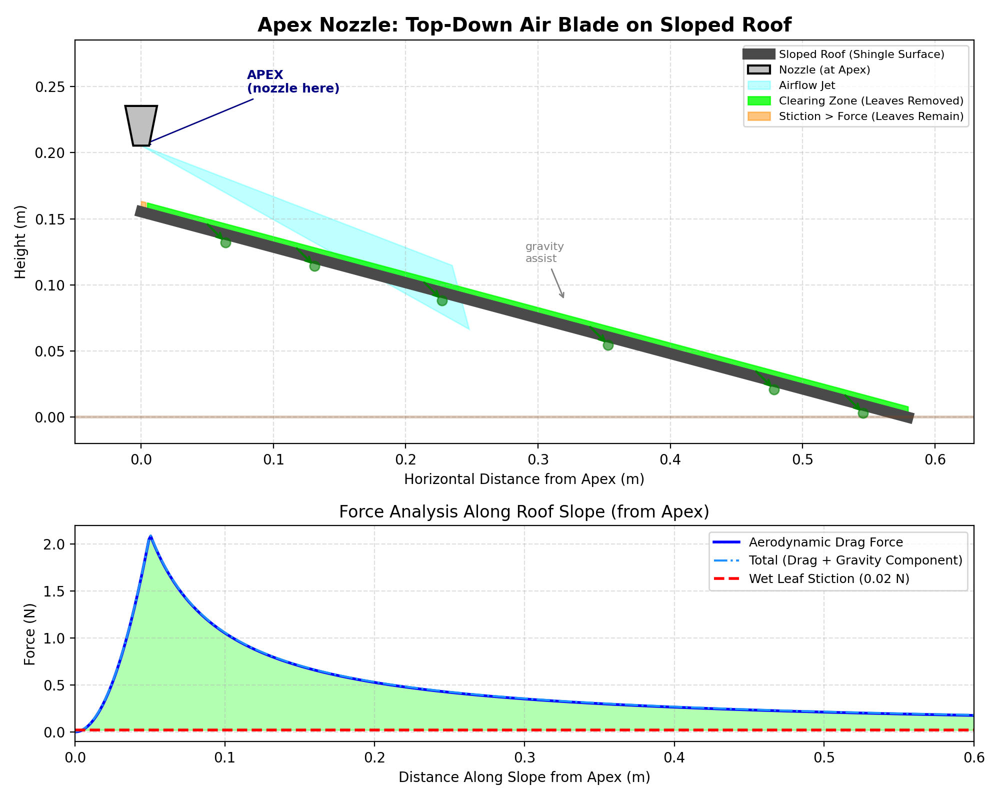
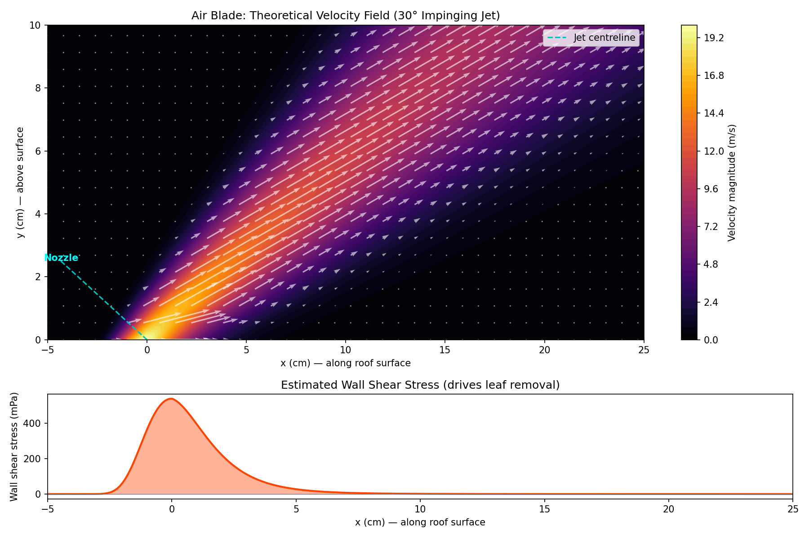

# ESC204 - Jinesis Group Master File

This single markdown document consolidates the entire project context, hardware iterations, firmware code, and visualization outputs.

## 1. Hardware Iterations
**Iteration 1: DC Motor on Breadboard**  

**Iteration 2: H-Bridge Integration**  

**Final Architecture: Nema 17 Stepper + A4988**  

## 2. Visualizations
**Professional CFD Sim (Turbulent Jet Model):**  

**Prototype Intuitive Visualization:**  

**Apex Downward-Jet Visualization:**  

**Theoretical Boundary Layer:**  

## 3. Code \& Firmware
Refer to the `firmware/` and `analysis/` folders in this repo for the CircuitPython scripts governing the Raspberry Pi Pico and the mathematical visualization scripts for drag force and fluid dynamics.
